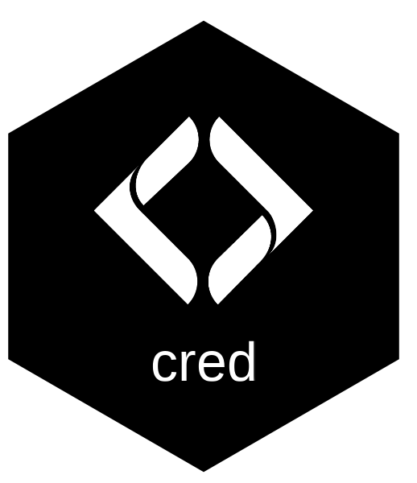

<!-- README.md is generated from README.Rmd. Please edit that file -->

# cred — Citation Review and Evidence Documentation 

`cred` catches a specific failure mode in LLM-assisted scientific
writing: a real citation key attached to a claim the source does not
actually make. It automates the tedious part — finding the right passage
in a PDF or Word doc — so a human can focus on the judgment call.

## Installation

``` r
pak::pak("NewGraphEnvironment/cred")
```

## The workflow

    Rmd files  →  audit CSV  →  eval inline  →  verify  →  score  →  review app

**1. Generate the audit CSV** — one row per citation, with the
surrounding sentence as `paraphrase`:

``` r
crd_aud_write(rmd_dir = ".", out_file = "qa/citation_audit.csv")
```

**2. Resolve inline R expressions** — if paraphrases contain inline R
spans (e.g., backtick-r-var-backtick), evaluate them in your current
session. Source your project’s setup chunks first so the variables
exist:

``` r
source("scripts/packages.R")
source("scripts/functions.R")
crd_aud_eval_inline("qa/citation_audit.csv")
```

The raw paraphrase is preserved; resolved values go in
`paraphrase_eval`. Scoring and matching use `paraphrase_eval` when
available.

**3. Auto-fill quotes from source documents** — queries your local
Zotero database for PDF/docx attachments, searches each one for the
best-matching passage, fills `quote`, `page_or_section`, and
`verified = "auto"`. Top-3 candidate passages are stored as JSON in
`candidate_quotes`:

``` r
crd_aud_verify_all("qa/citation_audit.csv")
```

**4. Abstract fallback for remaining NA rows** — for citations with no
local file, scores the Zotero abstract against the paraphrase. Sets
`verified = "abstract_match"` if the abstract is in the same domain as
the claim:

``` r
crd_aud_verify_abstract("qa/citation_audit.csv")
```

**5. Score for review priority** — adds `review_score` (1–6) and
`review_flag`. Lower scores are more suspect:

``` r
crd_aud_score("qa/citation_audit.csv")
```

**6. Launch the review app** — paraphrase and quote side by side,
collapsible panel showing alternative candidate passages, dropdown to
set `verified`, text search filters, saves back to CSV:

``` r
crd_aud_review("qa/citation_audit.csv")
```

## What each `verified` value means

| Value | Meaning |
|----|----|
| `auto` | Machine-matched against source file — awaiting your review |
| `abstract_match` | Matched against Zotero abstract — no full text available |
| `yes` | Reviewed and confirmed accurate |
| `no` | Claim not supported by source |
| `corrected` | Claim was wrong; you fixed it in the Rmd |
| `no_match` | Source exists but paraphrase did not score above threshold |
| `context` | Citation provides context, not a direct factual claim |
| `NA` | No source file and no abstract in Zotero |

## Keeping the CSV up to date

After editing Rmd files:

``` r
# Merge new citations; preserves manual edits via exact + fuzzy join
crd_aud_upd("qa/citation_audit.csv")
```

Exact match on `(section, citation_key, paraphrase)` first. Reworded
sentences fall back to token-similarity matching (default threshold
0.4), so minor edits don’t lose your review work. Git history tracks the
audit trail.

## Zotero integration

`cred` queries the local Zotero SQLite database directly — no Zotero API
key needed, no network call. It uses an immutable read-only URI so the
query never blocks a running Zotero process.

Attachments must be stored locally (not just cloud-linked). If a
citation key has no attachment, the row gets `verified = NA`.
`crd_aud_summary()` lists these ranked by claim count — attach the
highest-impact PDFs first.

## How matching works

For each unverified row, `cred` scores every paragraph in the source
document by the fraction of query tokens found in it:

    score = tokens from paraphrase found in paragraph / total tokens in paraphrase

The default threshold is **0.2** — 1 in 5 query tokens must appear in
the candidate paragraph. This is deliberately permissive: a false
positive (wrong paragraph shown as `auto`) costs a few seconds of
review; a false negative (right paragraph called `no_match`) means
searching the PDF yourself.

`min_score` is exposed in every matching function:

``` r
crd_aud_verify_all("citation_audit.csv", min_score = 0.2)  # default
```

| Situation                                       | Suggested `min_score` |
|-------------------------------------------------|-----------------------|
| Generic paraphrases — many false positives      | 0.3 – 0.4             |
| Default — specific factual claims with numbers  | 0.2                   |
| Long dense sources where good matches score low | 0.1 – 0.15            |

After adjusting, re-run with `overwrite_verified = TRUE` to reprocess
machine-assigned rows without touching human-reviewed ones (`yes`, `no`,
`corrected`, `context`).

## Learn more

``` r
vignette("citation-audit", package = "cred")
```

The vignette walks through the full workflow with toy source files
(PDF + docx) and a minimal Zotero SQLite database that ship with the
package.
