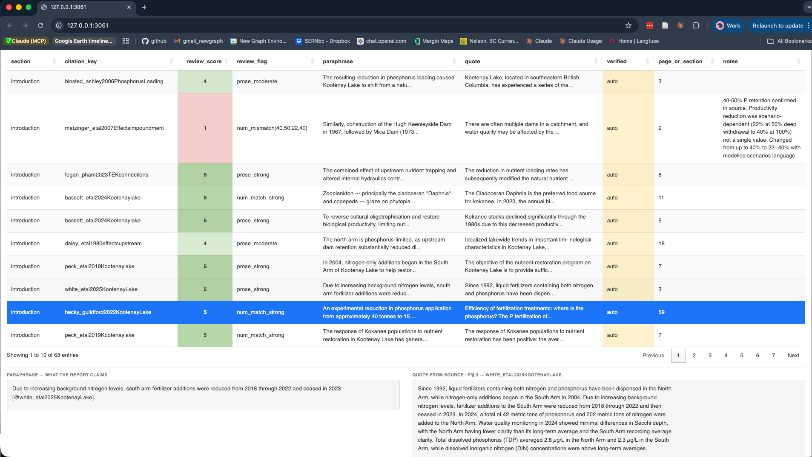
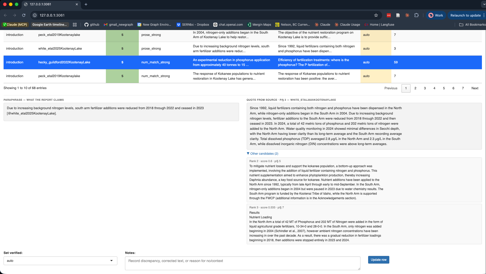

# Citation Audit Workflow

## The problem

When a report is drafted with LLM assistance, a specific failure mode
arises: the citation key is real, the prose sounds authoritative, but
the cited source does not actually support the specific claim made. A
percentage gets transposed, a finding from one paper gets attributed to
another, or a result gets quietly generalised.

`cred` addresses this systematically. For every `@citekey` in a bookdown
report it locates the source document, finds the best-matching passage,
and surfaces it alongside the original claim so a human can make the
call.

## Workflow at a glance

    Rmd files  -->  audit CSV  -->  Zotero lookup  -->  auto-fill quotes  -->  score  -->  review

| Step | Function | What it does |
|----|----|----|
| 1 | [`crd_aud_write()`](https://newgraphenvironment.github.io/cred/reference/crd_aud_write.md) | Scan Rmd files, extract citations with paraphrase context, write CSV |
| 2 | [`crd_aud_eval_inline()`](https://newgraphenvironment.github.io/cred/reference/crd_aud_eval_inline.md) | Resolve inline R expressions so matching has real numbers |
| 3 | [`crd_aud_verify_all()`](https://newgraphenvironment.github.io/cred/reference/crd_aud_verify_all.md) | Look up Zotero attachments, search each source, fill `quote` and `verified` |
| 4 | [`crd_aud_verify_abstract()`](https://newgraphenvironment.github.io/cred/reference/crd_aud_verify_abstract.md) | For remaining NA rows, score against Zotero abstract text |
| 5 | [`crd_aud_score()`](https://newgraphenvironment.github.io/cred/reference/crd_aud_score.md) | Add `review_score` (1–6) and `review_flag` |
| 6 | [`crd_aud_review()`](https://newgraphenvironment.github.io/cred/reference/crd_aud_review.md) | Launch interactive Shiny app for human review |

------------------------------------------------------------------------

## Walkthrough with toy data

`cred` ships toy source documents and a minimal Zotero SQLite in
`inst/extdata/`. The walkthrough below runs all steps silently, then
shows the scored results.

### Scored results

[`crd_aud_write()`](https://newgraphenvironment.github.io/cred/reference/crd_aud_write.md)
extracted 9 citation rows from 2 chapters.
[`crd_aud_verify_all()`](https://newgraphenvironment.github.io/cred/reference/crd_aud_verify_all.md)
searched each source document for the best-matching passage.
[`crd_aud_verify_abstract()`](https://newgraphenvironment.github.io/cred/reference/crd_aud_verify_abstract.md)
handled the row with no file.
[`crd_aud_score()`](https://newgraphenvironment.github.io/cred/reference/crd_aud_score.md)
assigned review priority.

**Reading the results:**

- **`auto`** (yellow) — passage found, score \>= threshold. Compare
  paraphrase vs quote — notice the wording differs but the facts match.
- **`no_match`** (green) — the Pacific Salmon Treaty row cites
  `smith2020SalmonHabitat`, a freshwater habitat paper with nothing
  about harvest allocation. This is the core failure mode `cred`
  surfaces: real key, plausible prose, wrong source.
- **`abstract_match`** (blue) — `doe2021NoFile` has no PDF, but the
  Zotero abstract confirms the citation is in the right domain. Not as
  strong as `auto`.
- **Score 1** = most suspect (no_match, or numbers don’t appear in
  quote). **Score 4–5** = strong match. Review low scores first.

------------------------------------------------------------------------

### Resolving inline R expressions

One of the toy rows contains inline R — the paraphrase references
variables that would normally come from data pipelines during bookdown
rendering.
[`crd_aud_eval_inline()`](https://newgraphenvironment.github.io/cred/reference/crd_aud_eval_inline.md)
(step 2) resolved these before verification ran. The raw paraphrase is
always preserved; `paraphrase_eval` has the resolved version:

    #> paraphrase:       Tagged juvenile chinook accessed floodplain side channels at `r n_sites` beaver dam sites, achieving growth rates `r growth_pct`% higher than mainstem fish [@jones2019BeaverEcology].
    #> paraphrase_eval:  Tagged juvenile chinook accessed floodplain side channels at 3 beaver dam sites, achieving growth rates 40% higher than mainstem fish [@jones2019BeaverEcology].

The call that produced this:

``` r

# In a real project these come from your data pipeline
n_sites    <- 3
growth_pct <- 40

crd_aud_eval_inline(audit_file, overwrite = TRUE)
#> Evaluated inline R in 1 row(s)
```

[`crd_aud_score()`](https://newgraphenvironment.github.io/cred/reference/crd_aud_score.md)
uses `paraphrase_eval` when available, so the numbers can be compared
against the quote. In your pipeline, source your project setup first so
the variables exist:

``` r

source("scripts/packages.R")
source("scripts/functions.R")
crd_aud_eval_inline("qa/citation_audit.csv")
```

If a variable doesn’t exist, it warns and leaves that expression as-is.
Run from the same R session where your book builds.

------------------------------------------------------------------------

### Interactive review

``` r

crd_aud_review("qa/citation_audit.csv")
```



Filter by status, citation key, or section. Click any row to open the
detail panel:



The detail panel shows paraphrase and quote side by side. Click **Other
candidates** to expand alternative passages with their scores. Set
`verified` to `yes`, `no`, `corrected`, or `context`, add notes, click
**Update row**, then **Save to CSV**.

------------------------------------------------------------------------

## The verified values

| Value | Meaning | Next action |
|----|----|----|
| `auto` | Source matched above threshold | Read quote vs paraphrase; set yes/no/corrected |
| `abstract_match` | Zotero abstract matched – no full text | Judge if abstract is sufficient; set context or get PDF |
| `no_match` | Source exists, no paragraph matched | Check source manually; may be a wrong citation |
| `yes` | Reviewed and confirmed accurate | Done |
| `no` | Claim not supported by source | Fix the claim in the Rmd |
| `corrected` | Claim was wrong; you fixed it | Done |
| `context` | Source provides background, not a direct factual claim | Done |
| `NA` | No source file and no abstract in Zotero | Attach PDF to unlock |

------------------------------------------------------------------------

## Setting up your report

### Directory convention

Put the audit CSV and pipeline script in a `qa/` directory at your
report root:

    my-report/
    +-- 0100-introduction.Rmd
    +-- 0200-methods.Rmd
    +-- scripts/
    |   +-- citation_audit.R      # repeatable pipeline
    +-- qa/
        +-- citation_audit.csv     # the audit (git-tracked)

### The pipeline script

Create `scripts/citation_audit.R` – this is the one file you (or an LLM)
run every time. It handles first run vs. update automatically:

``` r

# scripts/citation_audit.R -- repeatable citation audit pipeline
library(cred)

audit_file <- "qa/citation_audit.csv"

# Step 1 -- Extract or update citations from Rmd chapters
if (file.exists(audit_file)) {
  crd_aud_upd(audit_file)
} else {
  crd_aud_write(out_file = audit_file)
}

# Step 2 -- Resolve inline R (run from session with project variables loaded)
# source("scripts/packages.R"); source("scripts/functions.R")  # if needed
crd_aud_eval_inline(audit_file)

# Step 3 -- Auto-fill quotes from Zotero source files
crd_aud_verify_all(audit_file)

# Step 4 -- Abstract fallback for NA rows
crd_aud_verify_abstract(audit_file)

# Step 5 -- Score for review priority
crd_aud_score(audit_file)

# Step 6 -- Summary
crd_aud_summary(audit_file)
```

Run the full pipeline after adding new citations or attaching new PDFs
in Zotero. Run just the quick update after editing existing text:

``` r

# Quick -- re-extract and re-score only (seconds, no Zotero lookup)
crd_aud_upd("qa/citation_audit.csv")
crd_aud_score("qa/citation_audit.csv")
```

### When to commit

The CSV is current state; git history is the audit trail.

| After… | Commit? | Why |
|----|----|----|
| Full pipeline run | Yes | Captures auto/no_match/abstract_match state |
| Shiny review session (Save to CSV) | Yes | Preserves human judgments |
| Quick [`crd_aud_upd()`](https://newgraphenvironment.github.io/cred/reference/crd_aud_upd.md) after Rmd edits | Yes | Records paraphrase changes + fuzzy matches |

A good commit message: `qa: update citation audit after intro rewrite`
or `qa: review 12 auto rows, 3 corrected`.

### How `crd_aud_upd()` preserves your work

When you reword a sentence in the Rmd, the paraphrase text changes.
[`crd_aud_upd()`](https://newgraphenvironment.github.io/cred/reference/crd_aud_upd.md)
handles this in two passes:

1.  **Exact join** on `(section, citation_key, paraphrase)` – unchanged
    rows carry forward all manual columns
2.  **Fuzzy fallback** – unmatched rows are compared by token similarity
    to existing rows with the same `(section, citation_key)`. If overlap
    \>= 0.4, manual columns (verified, quote, notes, scores) carry
    forward to the new text

The console reports what happened:
`94 rows (13 new/unverified, 1 fuzzy-matched)`.

### How source matching works

Both PDF/docx matching and abstract matching use the same token overlap
algorithm:

1.  Strip inline R, `@citekeys`, and markdown punctuation from
    `paraphrase`
2.  Extract word tokens (\>= 4 characters) and numeric tokens separately
    – numbers are the most discriminative signals
3.  Score each paragraph: proportion of query tokens found in the
    passage
4.  Accept the top-scoring passage if score \>= `min_score` (default
    0.2)

**What 0.2 means:** 1 in 5 query tokens must appear in the passage.
Deliberately permissive – a false positive costs seconds of review; a
false negative means searching the PDF yourself.

``` r

crd_aud_verify_all("citation_audit.csv", min_score = 0.2)       # default
crd_aud_verify_abstract("citation_audit.csv", min_score = 0.2)  # same threshold
```

Re-run with `overwrite_verified = TRUE` to reprocess machine-assigned
rows without touching human-reviewed ones.
